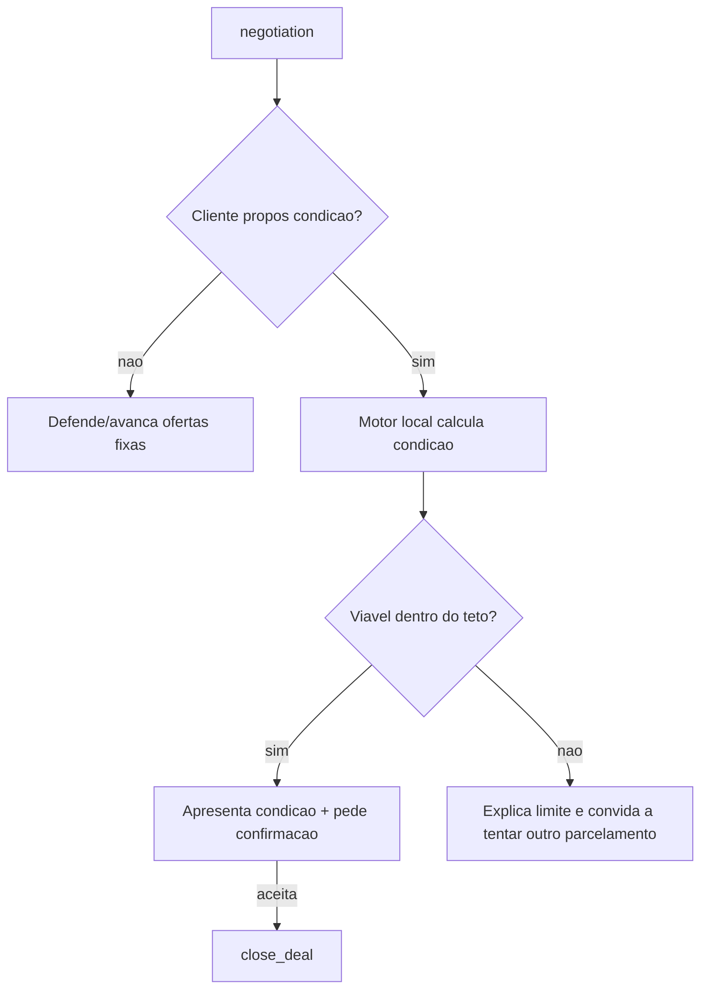

# Plano de Melhorias — Credit Agent

Documento de planejamento das próximas evoluções do agente de renegociação de dívidas.
Restrições assumidas: **dados mockados** (PostgreSQL local + `offers.json`), **sem MCP**,
**sem Kubernetes** e **sem múltiplos provedores de LLM**.

---

## Estado atual (resumo)

O agente já cobre o fluxo ponta a ponta:

```
greeting → authentication → fetch_customer → fetch_offers → negotiation → close_deal → farewell
```

- Prompts centralizados em `app/agent/prompts.py` (`COMPOSER_SYSTEM`, `TASK_*`, `NEGOTIATION_SYSTEM`).
- Identidade configurável (`agent_name`, `company_name`, etc.) via `app/settings.py`.
- Negociação com **defesa da oferta**: o agente argumenta a favor da condição atual
  (`rounds_per_offer`) antes de revelar a próxima, mostrando interesse no contexto do cliente.
- Captura de `debt_reason` durante a conversa.
- Acordos persistidos na tabela `agreements`.

---

## Melhoria 1 — Etapa de Sondagem (Probing) [PRIORITÁRIA]

### Problema
Hoje o cliente só pode **aceitar ou recusar** ofertas fixas do `offers.json`.
Se ele propõe algo próprio — *"consigo pagar em 8x"*, *"só tenho R$ 2.000 agora"* —
o agente ignora a contraproposta e apenas empurra a próxima oferta pré-definida.

### Objetivo
Permitir que o cliente **proponha** condições e que o agente responda com uma
condição calculada na hora (sem MCP, tudo local e determinístico).

### Proposta (sem MCP, mockada)
1. **Detecção de proposta** no `negotiation_node`: o `NEGOTIATION_SYSTEM` passa a
   devolver, além de `status`, campos opcionais:
   - `proposed_installments` (int ou null)
   - `proposed_amount` (float ou null)
2. **Motor de cálculo local** (`app/agent/tools/probe_tools.py`):
   - Recebe `debt_amount`, `proposed_installments` e/ou `proposed_amount`.
   - Aplica uma tabela de desconto por faixa de parcelas, definida em `settings`/JSON
     (ex.: 1x→50%, 2–3x→40%, 4–6x→30%, 7–12x→15%), respeitando um **desconto máximo (teto)**.
   - Rejeita propostas inviáveis (ex.: nº de parcelas acima do limite, valor abaixo do piso).
   - Retorna uma "oferta sintética" no mesmo formato das ofertas do `offers.json`.
3. **Novo status `"probe"`**: quando há proposta válida, o agente apresenta a condição
   calculada e pede confirmação. Se aceita → `close_deal` normal (a oferta sintética
   vira `selected_offer`). Se inviável → explica e convida a tentar outro parcelamento.
4. **Estado**: adicionar `negotiation_mode` (`"offer" | "probe"`) e, opcionalmente,
   `probe_offer` ao `AgentState`.

### Fluxo proposto



### Cuidado
O motor de cálculo precisa de um **teto de desconto** rígido para o agente não
"inventar" condições fora da política — toda a régua fica em config, nunca no LLM.

---

## Melhoria 2 — Limite de tentativas de autenticação

Hoje `authentication` entra em loop infinito se o cliente nunca informar CPF válido.
Adicionar:
- `auth_trials` no `AgentState` e `max_auth_attempts` em `settings`.
- Roteamento: após N tentativas, ir para `farewell` (variante `TASK_FAREWELL_NO_AUTH`,
  que já existe). Hoje essa variante é código defensivo inalcançável.

---

## Melhoria 3 — Robustez no fechamento de acordo

`close_deal` chama `save_agreement` sem tratamento de erro. Se o banco falhar,
o nó quebra. Adicionar `try/except`:
- Em caso de falha, logar o erro e seguir para `farewell` com mensagem adequada,
  evitando marcar `deal_closed=True` indevidamente.

---

## Melhoria 4 — Filtro/ranking de ofertas por perfil (refino)

Já existe `_rank_offers` por dívida/atraso. Possíveis refinos:
- Considerar `debt_reason` no ranqueamento (ex.: desemprego → priorizar mais parcelas).
- Tornar as faixas configuráveis em `settings`/JSON em vez de constantes no código.

---

## Melhoria 5 — Argumentação empática e contexto do cliente [PROMPTS]

### Problema observado
Quando o cliente revela uma dificuldade financeira (ex.: "perdi o emprego") ou fornece
um dado pessoal (número de telefone), o LLM tende a classificar como `farewell` e
encerrar a conversa prematuramente. Além disso, as respostas de defesa da oferta são
pouco personalizadas e não usam o contexto que o próprio cliente acabou de compartilhar.

### Objetivo
- Tratar qualquer revelação de dificuldade como **abertura de empatia**, não como recusa.
- Usar o `debt_reason` e o nome do cliente para personalizar cada argumento.
- Manter a conversa viva enquanto houver ambiguidade; encerrar só em recusa **definitiva**.
- Mensagens com tamanho adaptado ao momento (sem restrição rígida de parágrafos),
  mas sem listas nem blocos longos.

### Implementação (prompts)
1. Adicionar à `NEGOTIATION_SYSTEM` a seção **"Regra de ouro — dificuldade financeira NÃO é encerramento"**:
   reconhecer a situação + conectar ao benefício da oferta disponível.
2. Instrução explícita para dados pessoais (telefone, e-mail): agradecer brevemente e continuar.
3. Critério de `farewell` mais restrito: apenas recusa categórica e inequívoca.
4. Flexibilizar tamanho de resposta no `COMPOSER_SYSTEM`: "1–3 frases no usual" em vez de máximo rígido.

### Status
✅ Implementado nos prompts (junho/2026).

---

## Priorização sugerida

| Prioridade | Melhoria | Esforço | Impacto |
|---|---|---|---|
| 1 | Sondagem (probing) local | Médio | Alto |
| 2 | Argumentação empática (prompts) | Baixo | Alto |
| 3 | Limite de tentativas de auth | Baixo | Médio |
| 4 | Robustez no close_deal | Baixo | Médio |
| 5 | Ranking por perfil (refino) | Baixo | Baixo |
